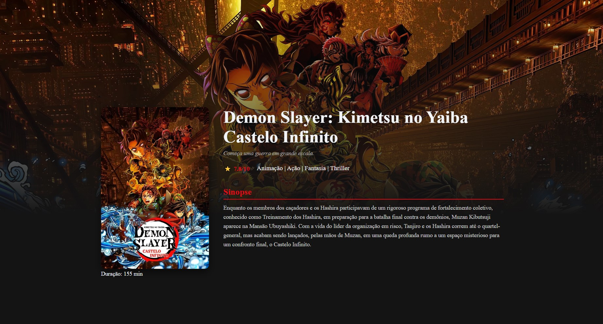
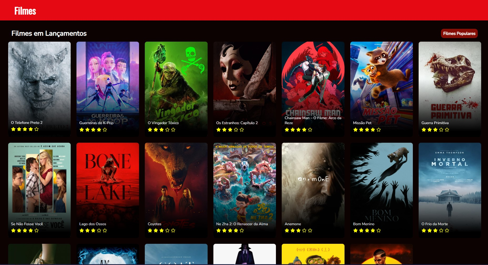

# 🎬 ProjetoMovies

Aplicação desenvolvida em **React/Next.js** que consome a **API do The Movie Database (TMDb)** para exibir informações sobre filmes populares, lançamentos e detalhes individuais de cada filme.

---

## 📸 Screenshots

Aqui estão algumas capturas de tela do projeto em execução:

### Tela Inicial (Filmes Populares)


### Página de Detalhes



### Filmes em Lançamento



---

## 🚀 Funcionalidades

- 🎞️ Exibição de **filmes populares**
- 🚀 Exibição de **lançamentos**
- 📖 Página de **detalhes do filme**
- 💻 Layout **responsivo e componentizado** (menu, rodapé e cards)

---

## 🛠️ Tecnologias Utilizadas

- [React](https://reactjs.org/)
- [Next.js](https://nextjs.org/)
- [Axios](https://axios-http.com/)
- [TMDb API](https://developer.themoviedb.org/)
- [Sass / CSS Modules]

---

## ⚙️ Configuração do Ambiente

Antes de rodar o projeto, crie um arquivo chamado **`.env`** na raiz do projeto e adicione sua chave da TMDb API:

```bash
NEXT_PUBLIC_TMDB_API_KEY=SUA_CHAVE_AQUI
# Clone o repositório
git clone [https://github.com/pauloosmt/ProjetoMovies.git](https://github.com/pauloosmt/ProjetoMovies.git)

# Acesse a pasta do projeto
cd ProjetoMovies

# Instale as dependências
npm install

# Rode o projeto localmente
npm run dev